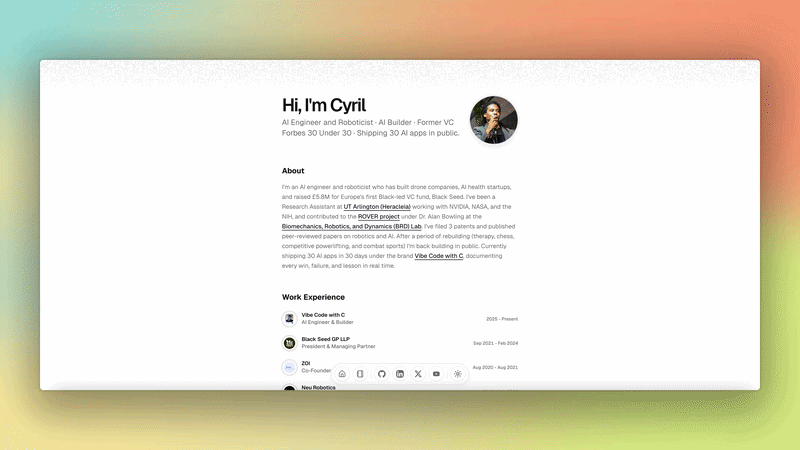

<div align="center">

</div>

# Cyril Lutterodt — Portfolio

Personal portfolio for Cyril Lutterodt — software engineer, AI builder, Forbes 30 Under 30, and creator of the [Vibe Code with C](https://youtube.com/@dayinthelifeofatechie) series.

Live at [cyrillutterodt.com](https://cyrillutterodt.com)

Built with Next.js, [shadcn/ui](https://ui.shadcn.com/), and [Magic UI](https://magicui.design/), deployed on Vercel.

# Stack

- Next.js 14 (App Router)
- TypeScript
- Tailwind CSS
- shadcn/ui + Magic UI
- Framer Motion
- pnpm

# Getting Started Locally

1. Clone this repository:

   ```bash
   git clone https://github.com/Spottybadrabbit/cyril-portfolio-website
   ```

2. Move to the directory:

   ```bash
   cd cyril-portfolio-website
   ```

3. Install dependencies:

   ```bash
   pnpm install
   ```

4. Start the dev server:

   ```bash
   pnpm dev
   ```

5. Edit content in [src/data/resume.tsx](./src/data/resume.tsx)

# License

Licensed under the [MIT license](./LICENSE).
